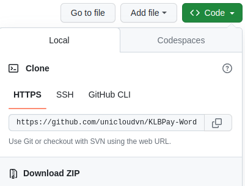
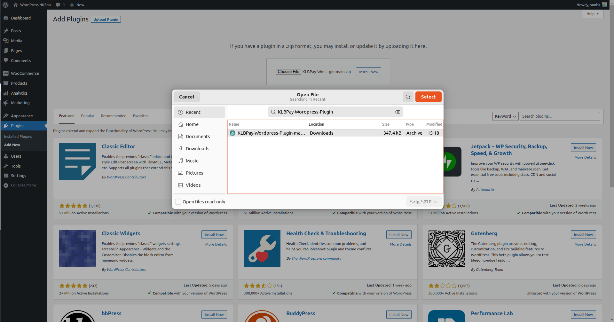
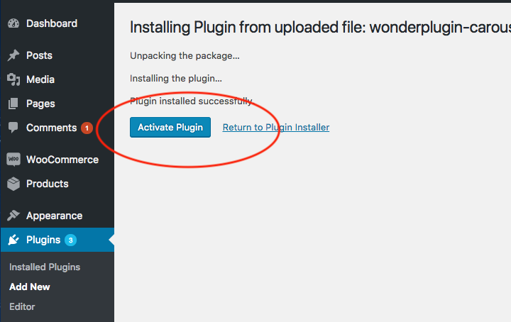
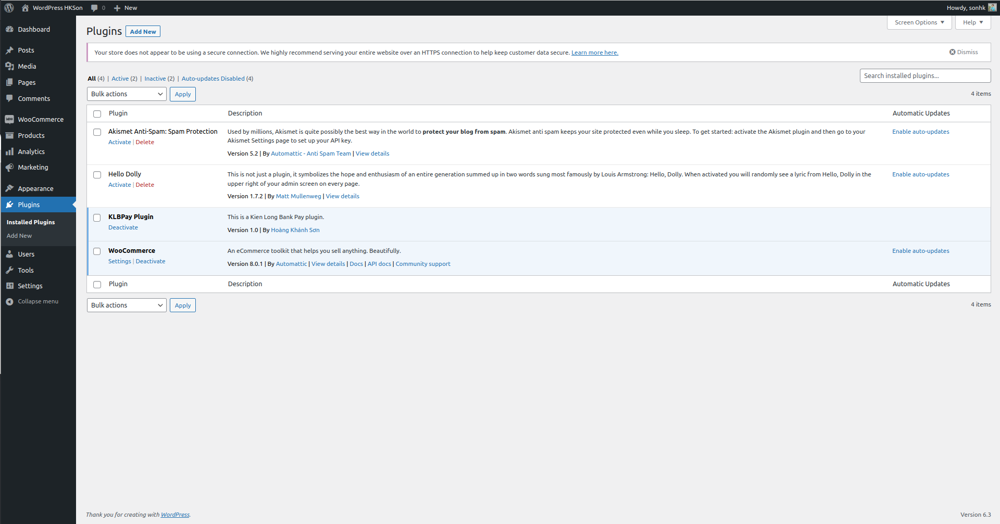
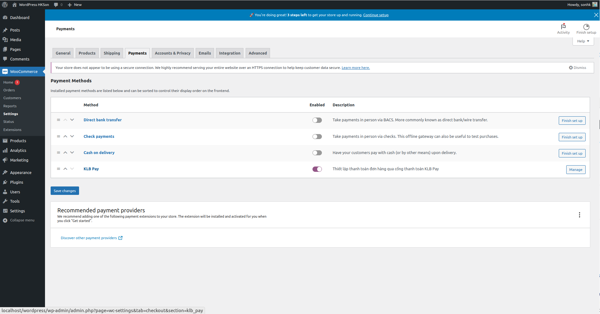
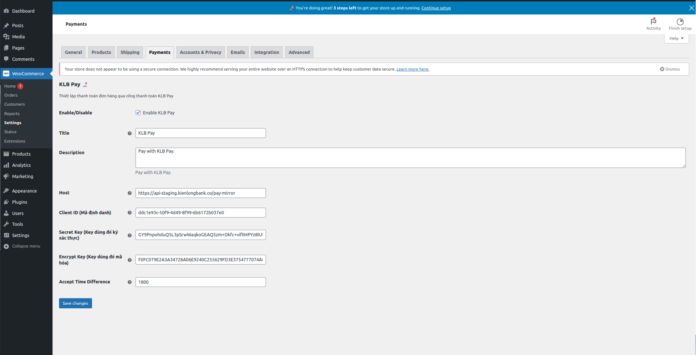
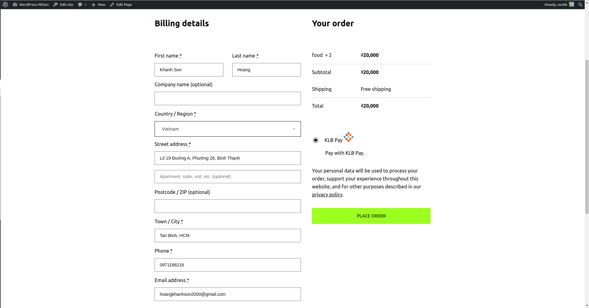

# KLBPay-Wordpress-Plugin
# Tích Hợp KLB Pay cho WooCommerce

Đây là hướng dẫn về cách tích hợp KLB Pay vào WooCommerce thông qua việc tải lên tệp plugin từ file zip.

## Cài Đặt

1. Tải plugin KLB Pay từ [trang chính thức](https://github.com/unicloudvn/KLBPay-Wordpress-Plugin).

2. Trong trang quản trị WordPress, điều hướng đến "Plugins" > "Thêm mới".
3. Chọn "Tải lên plugin" ở góc trên bên phải của trang.
4. Chọn tệp plugin KLB Pay đã tải xuống.

5. Sau khi tải lên thành công, kích hoạt plugin.

## Cấu Hình
1. Đăng nhập vào tài khoản KLB Pay của bạn và tạo tài khoản kết nối.
2. Lấy thông tin khách hàng như Client ID, Encrypt Key, Secret Key và Host.
3. Vào trang cài đặt của plugin trong trang quản trị WooCommerce -> Setting -> Payment -> KLB Pay và điền thông tin đã lấy vào các trường tương ứng.

## Sử Dụng

Plugin sẽ tự động xử lý thanh toán của Order qua KLB Pay khi đơn hàng chuyển sang trạng thái "Pending Payment", khi thanh toán thành công thì chuyển thành trạng thái "On Hold" để bên quản lý trang xử lý order tiếp.

## Gỡ Bỏ

1. Tắt plugin từ trang quản trị WordPress.
2. Để gỡ bỏ hoàn toàn, vào trang "Plugins" > "Danh sách" và tắt plugin KLB Pay.

## Hỗ Trợ

Nếu bạn gặp vấn đề hoặc cần hỗ trợ, vui lòng liên hệ với đội hỗ trợ của KLB Pay.

